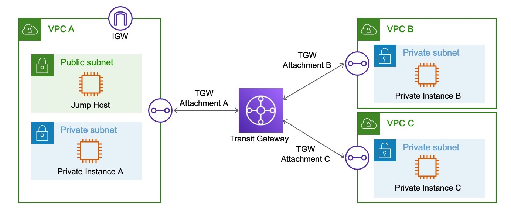

# transitgateway-cfn
CloudFormation Code for the Creation of a Transit gateway

Note: Ensure that you have created at least one EC2 private key pair to specify in the stack. 

Deployment Options:
transitgateway.yaml - Creates the VPCs and Transit Gateway without Provisioning Sample Servers
transitgateway-ec2.yaml - Creates the VPCs and Transit Gateway alongside 4 Sample Servers, 1 for each subnet

